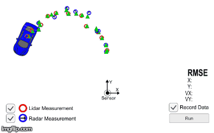

# Extended Kalman Filter: 
Using lidar and radar to track position and velocity

-Lidar: red.

-Radar: blue.

-Predicted locations: green.

---
## Overview
1. About this simulator
1. Dependencies
1. Build instructions

---
## About
1. main.cpp reads in lidar and radar readings
1. FusionEKF initializes state variables, and runs prediction / update cycles using kalman_filter.cpp
1. kalman_filter.cpp implements:

    -Predict(): calculating new x and P after some time

    -Update(): using incoming lidar readings and measurment transition matrix to calculate new x and P

    -UpdateEKF(): using linear approximation of lidar readings through Jacobian matrix to calculate new x and P
1. tools.cpp calculates the jacobian matrix and the root mean squared error, a measure of distance from ground truth 
1. kalman-tracker.py visualizes readings and predictions in a simulator (pictured)

---
## Dependencies

* cmake >= 3.5
 * All OSes: [click here for installation instructions](https://cmake.org/install/)
* make >= 4.1
  * Linux: make is installed by default on most Linux distros
  * Mac: [install Xcode command line tools to get make](https://developer.apple.com/xcode/features/)
  * Windows: [Click here for installation instructions](http://gnuwin32.sourceforge.net/packages/make.htm)
* gcc/g++ >= 5.4
  * Linux: gcc / g++ is installed by default on most Linux distros
  * Mac: same deal as make - [install Xcode command line tools]((https://developer.apple.com/xcode/features/)
  * Windows: recommend using [MinGW](http://www.mingw.org/)

---
## Basic Build Instructions

1. Clone this repo.
2. Make a build directory: `mkdir build && cd build`
3. Compile: `cmake .. && make` 
   * On windows, you may need to run: `cmake .. -G "Unix Makefiles" && make`
4. Run it: `./ExtendedKF path/to/input.txt path/to/output.txt`. You can find
   some sample inputs in 'data/'.
    - eg. `./ExtendedKF ../data/obj_pose-laser-radar-synthetic-input.txt`